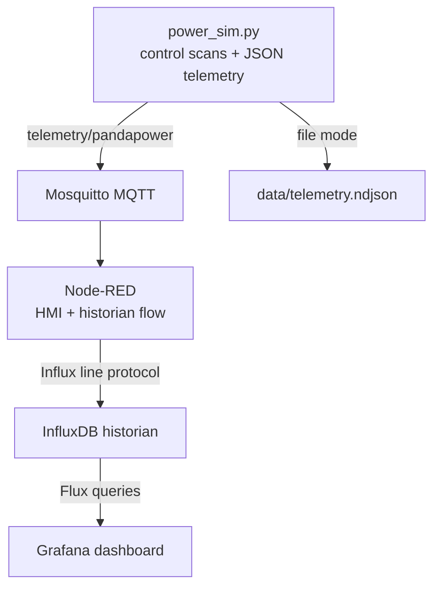
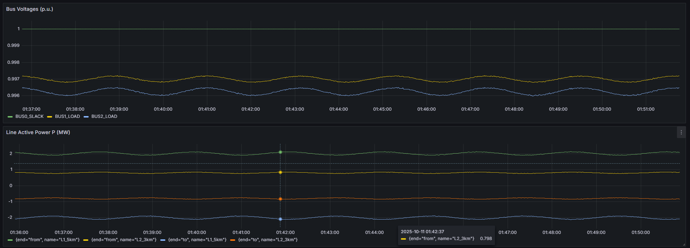

# jspX v0.5.0 - joySCADA_Power X (Simulated Power System)

A minimal, reproducible SCADA loop for a simulated power portfolio:
- Python sim emits timestamped JSON lines (buses, lines, ext_grid) at 1 s intervals
- Node-red ingest via MQTT **or** file tail into historian InfluxDB
- Display latest values on grafana dashboard
- Clean structure, least privilege, and beginner-friendly



## Grid Model

20 kV feeder (3-bus minimal case)

   [BUS0_SLACK] --[BRK_L1_SOURCE]--L1(5 km)--> [BUS1_LOAD] --[BRK_L2]--L2(3 km)--> [BUS2_LOAD]
       ext_grid                                      ~1.2 MW / 0.3 MVAr        ~0.8 MW / 0.2 MVAr
       vm≈1.00 pu                                    vm≈0.98–0.99 pu           vm≈0.97–0.99 pu

Both breakers are real pandapower line switches with independent authoritative
`BreakerController` state. The simulator applies controller positions during
its 50 ms control scan while retaining the configured SCADA publication
interval. MQTT callbacks and the HMI only enqueue commands; they never write
the physical switches directly.

When `BRK_L1_SOURCE` opens, L1 current/loading is zero and both downstream buses
are isolated. Unavailable voltage/angle values are JSON `null`, with
`energized: false` and `quality: "NOT_ENERGIZED"`.

`BRK_L2` is a real pandapower line switch at the BUS1 end of L2. Opening only
this switch leaves BUS1 supplied through L1 while BUS2 and L2 report the
downstream section as not energized.

### Breaker MQTT contract

Pandapower MQTT mode uses payload-independent named command topics and retained
authoritative status for each breaker:

| Breaker | Open | Close | Reset | Retained status |
| --- | --- | --- | --- | --- |
| `BRK_L1_SOURCE` | `cmd/breaker/BRK_L1_SOURCE/open` | `cmd/breaker/BRK_L1_SOURCE/close` | `cmd/breaker/BRK_L1_SOURCE/reset` | `status/breaker/BRK_L1_SOURCE` |
| `BRK_L2` | `cmd/breaker/BRK_L2/open` | `cmd/breaker/BRK_L2/close` | `cmd/breaker/BRK_L2/reset` | `status/breaker/BRK_L2` |

For v0.4 compatibility, `cmd/breaker/open`, `cmd/breaker/close`,
`cmd/breaker/reset`, and retained `status/breaker` remain L1 aliases; they do
not address L2. Named status includes `breaker`, timestamp, state, trip latch,
trip reason, and undervoltage alarm. The simulator publishes status after the
control scan applies a command or protection transition. `RESET` clears the
latch without closing, and `CLOSE` is rejected while that breaker's latch is
active. `telemetry/pandapower` remains non-retained and is not authoritative
breaker state.

The tracked Node-RED HMI publishes named commands and displays retained named
status for both breakers. For example, from the repository directory:

```powershell
docker compose exec -T mosquitto mosquitto_pub -h mosquitto -t cmd/breaker/BRK_L2/open -n
docker compose exec -T mosquitto mosquitto_pub -h mosquitto -t cmd/breaker/BRK_L2/close -n
```

### Validation scenario MQTT contract

Pandapower MQTT mode subscribes to `cmd/sim/scenario/set`. Its payload must be
exactly one of `NORMAL`, `OVERCURRENT`, `UNDERVOLTAGE`, or
`DOWNSTREAM_OVERCURRENT` (uppercase UTF-8 with no surrounding whitespace).
Unknown or invalid payloads are rejected without changing the selected scenario
or plant inputs.

- `NORMAL` restores the 1.0 pu source setpoint and base downstream demand. It
  does not reset a protection latch or operate the breaker.
- `OVERCURRENT` applies five times the base downstream MW/MVAr demand without
  changing L1's current rating, allowing the existing protection to trip L1.
- `UNDERVOLTAGE` lowers the source setpoint to 0.90 pu. It asserts the existing
  downstream undervoltage alarm but does not directly trip L1.
- `DOWNSTREAM_OVERCURRENT` asserts a persistent, deterministic teaching signal.
  L2 trips first after 100 ms; if the condition remains asserted, L1 trips as
  delayed backup 100 ms later.

### Data contracts

These are the compact interfaces between the simulator, MQTT, Node-RED, and
InfluxDB. JSON uses `null` for unavailable measurements; it never uses `NaN`.

#### `telemetry/pandapower`

The simulator publishes one object at the configured SCADA interval. The
representative shape is:

```json
{
  "ts": "2026-09-19T12:00:00+00:00",
  "buses": [
    {
      "bus_idx": 1,
      "name": "BUS1_LOAD",
      "vm_pu": 0.986,
      "va_degree": -0.4,
      "p_mw": 1.2,
      "q_mvar": 0.3,
      "energized": true,
      "quality": "GOOD"
    }
  ],
  "lines": [
    {
      "line_idx": 1,
      "name": "L2_3km",
      "end": "from",
      "from_bus": 1,
      "to_bus": 2,
      "p_mw": 0.8,
      "q_mvar": 0.2,
      "pl_mw": 0.01,
      "ql_mvar": 0.02,
      "i_ka": 0.03,
      "vm_pu": 0.986,
      "va_degree": -0.4,
      "loading_percent": 15.0,
      "energized": true,
      "quality": "GOOD"
    }
  ],
  "ext_grid": {
    "p_mw": 2.0,
    "q_mvar": 0.5
  }
}
```

| Object | Main fields |
| --- | --- |
| `buses[]` | `bus_idx`, `name`, voltage/angle, P/Q, `energized`, `quality` |
| `lines[]` | identity/endpoints, P/Q, losses, current, voltage/angle, loading, `energized`, `quality` |
| `ext_grid` | source P/Q |
| `ts` | ISO-8601 observation timestamp |

When a breaker isolates a section, unavailable voltage and angle values are
`null`; the affected object reports `energized: false` and
`quality: "NOT_ENERGIZED"`.

#### Named breaker status

Each retained `status/breaker/<breaker>` message has this shape:

```json
{
  "ts": "2026-09-19T12:00:00.120Z",
  "breaker": "BRK_L2",
  "state": "OPEN",
  "tripped": true,
  "undervoltage_alarm": false,
  "trip_reason": "overcurrent"
}
```

`state` is `OPEN` or `CLOSED`; `tripped` is the latch state; and
`trip_reason` is either a reason string or `null`. This status is authoritative.
The legacy `status/breaker` topic carries the L1 compatibility status.

#### Scenario command

`cmd/sim/scenario/set` accepts exactly:

```text
NORMAL
OVERCURRENT
UNDERVOLTAGE
DOWNSTREAM_OVERCURRENT
```

The payload is uppercase UTF-8 with no surrounding whitespace. A scenario
changes the simulator's deterministic teaching conditions; it does not itself
reset or operate a breaker.

#### InfluxDB mapping

Node-RED converts observations to Influx line protocol with millisecond
timestamps:

| Measurement | Tags | Fields |
| --- | --- | --- |
| `bus` | `bus_id`, `name` | `vm_pu`, `va_deg`, `p_mw`, `q_mvar`, `energized`, `quality` |
| `line` | `line_id`, `name`, `end`, `from_bus`, `to_bus` | `p_mw`, `pl_mw`, `q_mvar`, `ql_mvar`, `i_ka`, `vm_pu`, `va_deg`, `loading_percent` when present |
| `ext_grid` | `site=main` | `p_mw`, `q_mvar` |
| `breaker_status` | `breaker` | `state`, `tripped`, `undervoltage_alarm`, `trip_reason` |

The command audit path also writes a `breaker` measurement tagged
`source=command`. These records describe requested actions, not authoritative
plant state.

### Model boundary

- **Modeled:** a fixed three-bus feeder, two real line switches, authoritative
  controller/interlock state, and a deterministic L2-primary/L1-backup outcome.
- **Simplified:** the downstream-overcurrent input is scenario-driven and the
  primary/backup delays are a teaching sequence, not calculated fault current
  or coordinated relay settings.
- **Not modeled yet:** CT/VT behavior, relay curves and coordination studies,
  directional elements, breaker-failure protection, autoreclosing, and fault
  location.

## Getting started

### Prerequisites

- Docker Desktop with Docker Compose v2
- Git

Python is included in the simulator image, so it is not required on the host for the normal startup path.


### Quickstart

Clone the repository, enter it, and create the local environment file:

```powershell
Copy-Item .env.example .env
```

On Linux or macOS, use `cp .env.example .env` instead. The supplied values are development defaults and all ports bind to localhost. Change the credentials before exposing any service outside your computer.

Build and start the complete stack:

```powershell
docker compose up -d --build
docker compose ps
```

This starts the pandapower simulator, Mosquitto, Node-RED, InfluxDB, and Grafana. The simulator publishes one sample per second to `telemetry/pandapower`; the tracked Node-RED flow writes it to the `scada` bucket.

Node-RED persists each named authoritative status as `breaker_status` tagged by
breaker identity. It also stores bus/line energized and quality fields. The
provisioned Grafana Operations section shows both breaker states and latches,
recent primary/backup transitions, and feeder topology energization.

Open:

- Node-RED: http://localhost:1880
- InfluxDB: http://localhost:8086
- Grafana: http://localhost:3000

To inspect startup problems:

```powershell
docker compose logs --tail 100 sim mosquitto nodered influxdb grafana
```

To stop the stack while retaining database and application state:

```powershell
docker compose down
```

Runtime state is stored in Docker named volumes. `.env`, simulator output, Node-RED credentials/settings/cache, database files, and broker data are ignored by Git. The system definition and `nodered/data/flows.json` are tracked, so running the stack should not create files that Git asks you to commit.

#### Why v0.3.1 tracks these files

- `requirements.txt` and `dockerfile` define a Python 3.12 numerical stack that has been build-tested and can complete a pandapower step. The full dependency set is pinned because pandapower 3.1.2 currently fails with pandas 3.x.
- `nodered/data/flows.json` is the deployable flow and is the only tracked file under Node-RED's data directory. Node-RED credentials, settings, installed modules, caches, and backups remain runtime data.
- `package.json` and `nodered/Dockerfile` install the UI nodes referenced by the flow into the image. A new clone does not rely on a pre-existing `node_modules` directory.
- `docker-compose.yml` stores mutable Node-RED, Mosquitto, InfluxDB, and Grafana data in named volumes. Only the flow file and read-only provisioning/configuration are mounted from tracked paths.
- `.dockerignore` keeps local state and secrets out of Docker build contexts; `.gitignore` keeps the same runtime artifacts out of commits.
- Grafana's datasource UID is fixed to the UID referenced by the tracked dashboard, making provisioning deterministic on an empty Grafana volume.

When upgrading an existing checkout, old files under `nodered/data`, `mqtt/data`, and `mqtt/log` are not deleted. The v0.3.1 Compose configuration stops mounting those directories as service state. Node-RED uses the tracked flow plus a named volume, and Mosquitto uses named data/log volumes.

### Run the simulator on the host (optional)

Python 3.12 and 3.13 are supported by the pinned requirements. On Windows, create a fresh virtual environment and install them without activating the environment:

```powershell
py -3.13 -m venv .venv
.\.venv\Scripts\python -m pip install --upgrade pip
.\.venv\Scripts\python -m pip install -r requirements.txt
```

Start only the broker and run the simulator against the broker's localhost port:

```powershell
docker compose up -d mosquitto
.\.venv\Scripts\python src/power_sim.py --mqtt --pandapower
```

On Linux or macOS, use a Python 3.12 or 3.13 interpreter and `.venv/bin/python` in the equivalent commands. Omitting `--mqtt` writes to `data/telemetry.ndjson`; that generated file is ignored by Git.

### Historical verification


