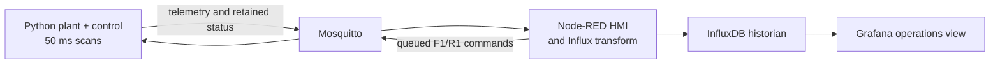

# jspX v0.6 candidate — joySCADA Power X

jspX is a small learning system that connects a solved pandapower feeder to an
operator and historian loop:



The current branch is an accepted Sprint 6 implementation candidate. It is not
a released `v0.6.0` until the separate merge, tag, and release decision.

## Reference feeder

```text
GRID_110KV
  → T1_PRIMARY, 25 MVA 110/20 kV
  → BUS_MV_SOURCE
  → BRK_F1
  → L1_FEEDER_HEAD, 5 km
  → BUS_R1_REMOTE
  → BRK_R1
  → L2_FEEDER_TAIL, 3 km
  → BUS_SS1_MV
  → T2_SS1, 2.5 MVA 20/0.4 kV
  → BUS_SS1_LV
  → LOAD_SS1_AGGREGATE, 2.00 MW + 0.50 MVAr nominal
```

F1 and R1 are real pandapower line switches. The overhead-line parameters are
`r=0.5939 Ω/km`, `x=0.372 Ω/km`, `c=9.5 nF/km`, and `max_i=0.21 kA`.
T2 uses `vk=6%`, `vkr=1%`, `pfe=6 kW`, `i0=0.25%`, and a 150° shift.

The plant owns source/load inputs, topology, power-flow solving, and
measurements. Each `BreakerController` owns its command interlock, trip latch,
definite-time overcurrent timer, and alarm state. `power_sim.py` is the only
writer that applies controller positions to the plant; MQTT callbacks only
enqueue intent. Control scans run every 50 ms, independently of 1 Hz SCADA
publication.

Opening F1 leaves the upstream grid, T1, and `BUS_MV_SOURCE` supplied while
de-energizing the remote point and SS1. Opening R1 leaves
`BUS_R1_REMOTE` supplied while de-energizing SS1. Unavailable measurements are
strict JSON `null`, with `energized: false` and
`quality: "NOT_ENERGIZED"`.

## Protection and scenarios

`cmd/sim/scenario/set` accepts exactly these uppercase payloads:

| Scenario | Plant input and expected protection result |
| --- | --- |
| `NORMAL` | 1.00 pu source and nominal aggregate demand. It does not reset a latch or operate a breaker. |
| `TAIL_OVERCURRENT_TEST` | Fivefold nominal aggregate input behind T2. Both elements see solved line current; R1 trips at 0.20 kA after 100 ms, then its open switch removes tail current and F1 remains closed. |
| `LOW_SOURCE_VOLTAGE` | 0.90 pu source. F1 alarms when `BUS_MV_SOURCE` is below 0.92 pu, clears at or above 0.94 pu, and does not trip. |

F1 uses `I> = 0.20 kA` with a 300 ms delay. R1 uses the same pickup with a
100 ms delay. `RESET` clears a latch without closing; `CLOSE` is rejected while
that latch is active.

The old `OVERCURRENT`, `UNDERVOLTAGE`, and `DOWNSTREAM_OVERCURRENT` payloads
are invalid.

## MQTT contracts

Commands are payload-independent; an empty payload is sufficient.

| Breaker | Open | Close | Reset | Retained authoritative status |
| --- | --- | --- | --- | --- |
| `BRK_F1` | `cmd/breaker/BRK_F1/open` | `cmd/breaker/BRK_F1/close` | `cmd/breaker/BRK_F1/reset` | `status/breaker/BRK_F1` |
| `BRK_R1` | `cmd/breaker/BRK_R1/open` | `cmd/breaker/BRK_R1/close` | `cmd/breaker/BRK_R1/reset` | `status/breaker/BRK_R1` |

There are no unqualified breaker command/status aliases and no identity-less
breaker object in routine telemetry. Each retained status has this form:

```json
{
  "ts": "2026-09-23T14:37:49.223Z",
  "breaker": "BRK_R1",
  "state": "OPEN",
  "tripped": true,
  "undervoltage_alarm": false,
  "trip_reason": "overcurrent"
}
```

Status transitions publish immediately after a control scan. Routine
`telemetry/pandapower` remains non-retained.

## Telemetry and historian mapping

The telemetry object contains `ts`, `buses[]`, `lines[]`, `transformers[]`, and
`ext_grid`. Representative transformer data is:

```json
{
  "transformer_idx": 1,
  "name": "T2_SS1",
  "hv_bus": 3,
  "lv_bus": 4,
  "p_hv_mw": 2.01,
  "q_hv_mvar": 0.61,
  "p_lv_mw": -1.99,
  "q_lv_mvar": -0.50,
  "i_hv_ka": 0.063,
  "i_lv_ka": 3.13,
  "vm_hv_pu": 0.967,
  "vm_lv_pu": 0.945,
  "loading_percent": 87.1,
  "energized": true,
  "quality": "GOOD"
}
```

Node-RED writes millisecond-timestamped Influx line protocol:

| Measurement | Tags | Main fields |
| --- | --- | --- |
| `bus` | `bus_id`, `name` | voltage, angle, P/Q, `energized`, `quality` |
| `line` | `line_id`, `name`, `end`, endpoint buses | P/Q, losses, current, voltage/angle, loading, `energized`, `quality` |
| `transformer` | `transformer_id`, `name`, HV/LV buses | HV/LV P/Q/current/voltage/angle, loading, `energized`, `quality` |
| `ext_grid` | `grid_id`, `name` | P/Q |
| `breaker_status` | `breaker` | state, latch, undervoltage alarm, trip reason |

Grafana shows bus voltage, line power, F1/R1 state and latch, F1 source-MV
alarm, recent protection status, feeder energization, and transformer loading.

## Start and operate

Prerequisites are Docker Desktop with Compose v2 and Git. Copy the development
defaults, then build and start the complete stack:

```powershell
Copy-Item .env.example .env
docker compose config --quiet
docker compose up -d --build
docker compose ps
```

All published ports bind to localhost:

- Node-RED HMI: http://localhost:1880/ui/
- InfluxDB: http://localhost:8086
- Grafana: http://localhost:3000

A compact operating walkthrough from the repository directory:

```powershell
# Observe retained state.
docker compose exec -T mosquitto mosquitto_sub -h mosquitto -t 'status/breaker/#' -v

# Operate R1.
docker compose exec -T mosquitto mosquitto_pub -h mosquitto -t cmd/breaker/BRK_R1/open -n
docker compose exec -T mosquitto mosquitto_pub -h mosquitto -t cmd/breaker/BRK_R1/close -n

# Run the solved-current selectivity test.
docker compose exec -T mosquitto mosquitto_pub -h mosquitto -t cmd/sim/scenario/set -m TAIL_OVERCURRENT_TEST

# A latched R1 rejects CLOSE. Restore inputs, reset without closing, then close.
docker compose exec -T mosquitto mosquitto_pub -h mosquitto -t cmd/sim/scenario/set -m NORMAL
docker compose exec -T mosquitto mosquitto_pub -h mosquitto -t cmd/breaker/BRK_R1/reset -n
docker compose exec -T mosquitto mosquitto_pub -h mosquitto -t cmd/breaker/BRK_R1/close -n
```

When reusing a broker volume last run by v0.5, clear its three obsolete retained
status messages once; this does not remove the volume or any historian data:

```powershell
docker compose exec -T mosquitto mosquitto_pub -h mosquitto -t status/breaker -r -n
docker compose exec -T mosquitto mosquitto_pub -h mosquitto -t status/breaker/BRK_L1_SOURCE -r -n
docker compose exec -T mosquitto mosquitto_pub -h mosquitto -t status/breaker/BRK_L2 -r -n
```

Inspect problems with:

```powershell
docker compose logs --tail 100 sim mosquitto nodered influxdb grafana
```

Stop while retaining all named-volume data with `docker compose down`.

For optional host execution, use Python 3.12 or 3.13 and install both runtime
and test requirements into a virtual environment:

```powershell
py -3.13 -m venv .venv
.\.venv\Scripts\python -m pip install -r requirements.txt -r requirements-dev.txt
.\.venv\Scripts\python -m pytest -q
.\.venv\Scripts\python src/power_sim.py --pandapower
```

## Model boundary

- **Modeled:** fixed radial reference feeder; real F1/R1 line switches; source,
  line, bus, transformer, and aggregate-load power flow; solved-current
  definite-time protection; latch/reset/close interlock; source-MV alarm;
  operator-to-plant-to-historian loop.
- **Simplified:** the aggregate load is represented as 50% constant power and
  50% constant current so the mandated fivefold nominal input remains solvable.
  `TAIL_OVERCURRENT_TEST` is a deterministic overload test, not a calculated
  fault or protection-coordination study. Loads vary slightly for routine live
  telemetry.
- **Not modeled:** CT/VT chains, relay curves, short-circuit calculation,
  breaker failure, autoreclose, transformer/LV protection, RTU/gateway or IEC
  61850, extra feeders, ring supply, DER, and production security.

Versioned definitions live in `docker-compose.yml`, `requirements.txt`,
`dockerfile`, `nodered/data/flows.json`, `grafana/provisioning/`, and
`mqtt/config/mqtt.conf`. Mutable service state remains in Docker named volumes.
