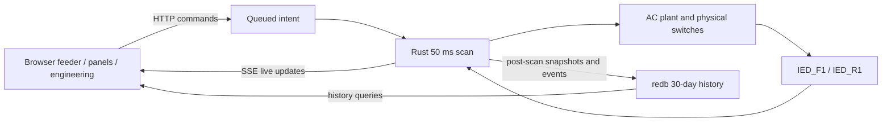

# jspX — Rust reference-feeder laboratory

jspX v1 is a local, balanced-AC simulation of one radial distribution feeder. A
single Rust application solves the plant, runs F1/R1 protection every 50 ms,
serves the operator and engineering views, and keeps 30 days of local history.
Docker Compose packages that application. There are no Python, MQTT, Node-RED,
InfluxDB, or Grafana runtime services in this worktree.


```mermaid
flowchart LR
  Browser[Browser feeder / panels / engineering] -->|HTTP commands| Queue[Queued intent]
  Queue --> Scan[Rust 50 ms scan]
  Scan --> Plant[AC plant and physical switches]
  Plant --> IED[IED_F1 / IED_R1]
  IED --> Scan
  Scan -->|post-scan snapshots and events| Store[redb 30-day history]
  Scan -->|SSE live updates| Browser
  Store -->|history queries| Browser
```

## Feeder and protection

```text
GRID_110KV (110 kV) ─ T1_PRIMARY (25 MVA, 110/20 kV) ─ BUS_MV_SOURCE
    ─ BRK_F1 ─ L1_FEEDER_HEAD (5 km) ─ BUS_R1_REMOTE
    ─ BRK_R1 ─ L2_FEEDER_TAIL (3 km) ─ BUS_SS1_MV
    ─ T2_SS1 (2.5 MVA, 20/0.4 kV) ─ BUS_SS1_LV
    ─ LOAD_SS1_AGGREGATE (2.00 MW + 0.50 MVAr nominal)
```

The overhead line uses `r=0.5939 Ω/km`, `x=0.372 Ω/km`, `c=9.5 nF/km`,
`max_i=0.21 kA`. T1 uses `vk=12%`, `vkr=0.41%`, `pfe=14 kW`, `i0=0.07%`,
and a 150° phase shift. T2 uses `vk=6%`, `vkr=1%`, `pfe=6 kW`, `i0=0.25%`,
and a 150° shift. The aggregate load is 50% constant power and 50% constant
current. The fixed AC model uses a 100 MVA base, transformer T equivalents,
line charging, and an angle-aware solve; frozen pandapower 3.1.2 outputs are in
`fixtures/pandapower_reference.json` for numerical comparison.

F1 and R1 are physical switches in the Rust plant. Opening F1 leaves the grid,
T1, and `BUS_MV_SOURCE` supplied while isolating the remote point and SS1.
Opening R1 leaves `BUS_R1_REMOTE` supplied and isolates SS1. Protection uses
solved line current at both terminals: F1 and R1 pick up at 0.20 kA; R1 trips
after 100 ms and F1 backs up after 300 ms if current persists. F1 alarms below
0.92 p.u. at the source-MV bus and clears at or above 0.94 p.u.; R1 has no
undervoltage action. Timers use monotonic elapsed time. An accepted operation
is only a request: position, status, events, solved topology, and views use
physical post-scan feedback. CLOSE is rejected while latched; RESET clears the
latch without moving a switch.

## Start and operate

Prerequisites: Docker Desktop with Compose v2. From this worktree:

```powershell
docker compose config --quiet
docker compose up -d --build
docker compose ps
```

Open [the feeder view](http://localhost:8088/feeder),
[F1 panel](http://localhost:8088/panels/f1),
[R1 panel](http://localhost:8088/panels/r1), or
[engineering review](http://localhost:8088/engineering). The sole published
port binds to `127.0.0.1`; set `JSPX_PORT` before `docker compose up` if 8088
is occupied. The panel portrayals are read-only. The feeder view's OPEN,
CLOSE, and RESET buttons send queued remote intent and wait for physical
feedback. Scenario selection is a test-harness API only.

Run a reproducible scenario from PowerShell:

```powershell
$base = 'http://localhost:8088/api/v1'
Invoke-RestMethod "$base/snapshot"
Invoke-RestMethod "$base/test/scenarios" -Method Post -ContentType 'application/json' -Body '{"scenario":"TAIL_OVERCURRENT_TEST"}'
# After observing R1's trip, restore inputs. This leaves the latch and switch unchanged.
Invoke-RestMethod "$base/test/scenarios" -Method Post -ContentType 'application/json' -Body '{"scenario":"NORMAL"}'
Invoke-RestMethod "$base/breakers/BRK_R1/commands" -Method Post -ContentType 'application/json' -Body '{"command":"RESET"}'
Invoke-RestMethod "$base/breakers/BRK_R1/commands" -Method Post -ContentType 'application/json' -Body '{"command":"CLOSE"}'
```

Allow at least one 50 ms scan between separate requests. The API's `202`
response means **queued**, not accepted or moved; read the later snapshot and
events. The event stream is `/api/v1/stream` (SSE). The four exact test
scenarios are:

| Scenario | Input and expected outcome |
| --- | --- |
| `NORMAL` | 1.00 p.u. source and nominal load; does not reset latches or move switches. |
| `TAIL_OVERCURRENT_TEST` | Fivefold load; R1 trips after 100 ms, tail current clears, and F1 remains closed. |
| `R1_OPENING_FAILURE_TEST` | Same load with a plant-boundary refusal of R1 OPEN; R1 stays physically closed and latched, then F1 opens after 300 ms. |
| `LOW_SOURCE_VOLTAGE` | 0.90 p.u. source; F1 asserts its voltage alarm without tripping. |

After the failure test, set `NORMAL`, RESET R1 and F1, then CLOSE F1. R1 is
already physically closed in that test. Scenario removal never resets latches
or moves switches. An application restart deliberately begins a new run in
`NORMAL` with both breakers closed and latches clear, records `RUN_STARTED`,
and keeps history from prior runs for 30 days.

Stop without deleting the named history volume with `docker compose down`.
Back up the volume by stopping the service and copying `history.redb`; do not
delete named volumes as routine verification. `docker compose logs --tail 100
app` shows runtime errors. A failed historian write stops the scan and makes
the service unhealthy rather than showing an unrecorded state as healthy.

## HTTP and history contract

| Endpoint | Meaning |
| --- | --- |
| `GET /api/v1/snapshot` | Latest completed scan: `run_id`, `seq`, UTC `ts`, scenario, physical breaker statuses, and bus/line/transformer/source telemetry. |
| `GET /api/v1/stream` | Live SSE messages with `kind=snapshot`, `kind=event`, or `kind=resync`. Re-read the snapshot after reconnect or resync. |
| `POST /api/v1/breakers/{BRK_F1\|BRK_R1}/commands` | JSON `{"command":"OPEN"\|"CLOSE"\|"RESET"}`; `202` returns `{request_id,queued:true}`. |
| `POST /api/v1/test/scenarios` | JSON `{"scenario":"NORMAL"\|"TAIL_OVERCURRENT_TEST"\|"R1_OPENING_FAILURE_TEST"\|"LOW_SOURCE_VOLTAGE"}`. |
| `GET /api/v1/history` | Stored post-scan snapshots at 1 Hz and status transitions. |
| `GET /api/v1/events` | Ordered scan-resolution IED, operation, scenario, and run events. |

History endpoints accept ISO-8601 `from` and `to`, `limit` (1–10000), and
returned `next_cursor`. The default window is 15 minutes, the maximum query
window is 24 hours, and retention is 30 days. Use UTC; record identity is
`run_id:sequence`. Events include `PICKUP`, `TIMING_STARTED`,
`TIMING_CANCELLED`, `TRIP_REQUEST`, `OPERATION_REQUEST`,
`POSITION_FEEDBACK`, `RESET`, and `CLOSE_REJECTED`, with `requested_state`,
`actual_state`, `success`, and `cause` where applicable. A refused R1 trip
records `actual_state="CLOSED"` and `success=false`. History and SSE status are
derived from the same post-scan result.

Unavailable electrical measurements are JSON `null`, never `NaN`. Assets
carry `energized` and `quality`: `GOOD`, `NOT_ENERGIZED`, or `UNKNOWN`. Charts
leave gaps for unavailable voltage/current, gaps between runs, and telemetry
gaps over 1.5 seconds. Actual voltage charts are separated by nominal level;
p.u. voltage states its bus base. The old Python model forced line current to
`0.0` whenever its switch was open. In Rust, measured `i_ka` is `null` when
the line is disconnected; `inferred_through_current_ka=0.0` identifies the
topological zero separately. An open upstream line may leave an energized bus
with small line-charging current. Protection only acts on available solved
current and actual closed position.

## Model boundary

- **Modeled:** fixed radial feeder; balanced AC power flow; two physical line
  switches; solved-current definite-time protection; F1 voltage alarm; queued
  remote control; plant feedback; local 30-day history; live and review views.
- **Simplified:** the fivefold tail condition is an overload, not a calculated
  fault. The R1 refusal is an explicit test injection at the plant-operation
  boundary, not a mechanical failure model. Routine demand has a small smooth
  deterministic variation.
- **Not modeled:** CT/VT chains, relay curves, short-circuit or coordination
  studies, breaker-failure protection, local panel control, Local/Remote
  authority, autoreclose, transformer/LV protection, IEC 61850, DER, extra
  feeders, or production authentication and TLS.

The Rust ownership and scan order are detailed in `docs/rust-reference.md`.
`docs/BACKLOG.md` records acceptance evidence. `flows/` contains legacy
exports only and is not loaded by the Rust runtime.
